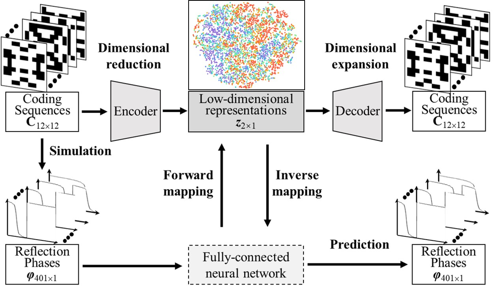

# Inverse-design-of-metasurfaces
This repository hosts a demonstration of a deep learning approach for the inverse design of metasurfaces, which consists of thousands of unit cells.
We wish we can design the targeted unit cell for given reflection phases within 1 second. x1000 faster than conventional methods.

The following papers have been published in relation to this repository:
1. [Inverse Design of Reflective Metasurface Antennas Using Deep Learning from Small-Scale Statistically Random Pico-Cells](https://onlinelibrary.wiley.com/doi/full/10.1002/mop.34068)
2. [Energy Efficient Design of Low-Profile Wideband Microstrip Patch Antennas Using Deep Learning](https://ieeexplore.ieee.org/document/10276793)

For ease of visulization,
We have created a GUI video that demonstrates the **Fast Design of Multi-Beam Metasurface Antennas**. You can watch it [here](https://www.bilibili.com/video/BV1DbHDerEY6/?spm_id_from=333.999.0.0).
Additionally, we have another video that demonstrates the **Inverse Design of Unit Cells**. You can watch it [here](https://www.bilibili.com/video/BV1Bx4y1D7LF/?spm_id_from=333.999.0.0&vd_source=07c2e4f919ec533eb2ddf652d4ab4c9b).

The architecture of the network is shown in the figure below. As can be seen, both high-dimensional sequences and reflection phases are mapping to a same low dimensional space and then reconstruct.

## Star ⭐⭐⭐
If you think this repository is helpful, please give us a STAR. Thank you very much!

# Dataset and Code Update - September 30, 2024

I have uploaded a dataset that comprises 300 samples. The dataset includes the following files:

- `x_train.npy`
- `y_train.npy`
- `freq_train.npy`
- `S11_train.npy`

Furthermore, the updated code, `VAE_CNN_300_sample.py`, has been successfully tested and executed on several computers, ensuring its compatibility and reliability across different platforms.

## Declaration:

Due to the need to use the complete dataset and the best-trained network model in the author's subsequent work, only 300 sample data and the code that has not been fully trained are provided here for learning, research, and exchange purposes. Please adhere to the following principles:

1. The code and data are strictly prohibited from being used for commercial purposes.
2. The code and data must not be copied, disseminated, or distributed without authorization.
3. When using the code and data, please respect intellectual property rights and indicate the source.
4. If there are research findings, please share them with the author to promote academic exchange and technological progress.

Thank you for your understanding and support. If you have any questions, please feel free to contact the author for discussion.

## Contact

For any questions or suggestions, please open an issue or directly contact the maintainers.

## License

This project is licensed under the MIT License - see the [LICENSE.md](LICENSE.md) file for details.

## Cite
If you use the code provided in this repository, please cite the following papers:

[1] X. C. You and F. H. Lin, “Inverse Design of Reflective Metasurface Antennas Using Deep Learning from Small-Scale Statistically Random Pico-Cells,” MICROW OPT TECHN LET., vol. 66, no. 2, pp.34068, Feb. 2024.

[2] X. C. You and F. H. Lin, “Energy Efficient Design of Low-Profile Wideband Microstrip Patch Antennas Using Deep Learning,” 2023 Int. Conf on Microw. Millim. Wave Tech, Qingdao, China, 2023, pp. 1-3.

[3] X. C. You and F. H. Lin, “Fast Design of Multi-Beam Metasurface Antennas Using Generative Machine Learning,” 2024 IEEE Asia-Pacific Conference on Antennas and Propagation (APCAP), Nanjing, China, 2024, accepted.

[4] X. C. You, C. T. Gao and F. H. Lin, “Significant Bandwidth Enahcnement of Low-Reflection Checkerboard Metasurfaces Using Machine Learning,” The 14th International Symposium on Antennas, Propagation and EM Theory (ISAPE), Hefei, China, 2024, accepted.

Thank you for your cooperation in acknowledging the original work.
